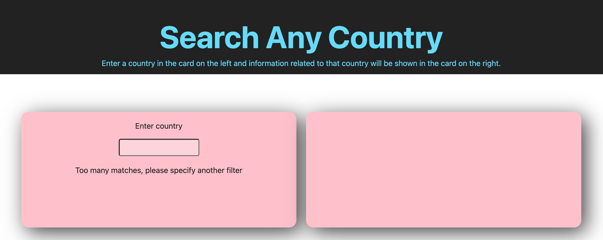
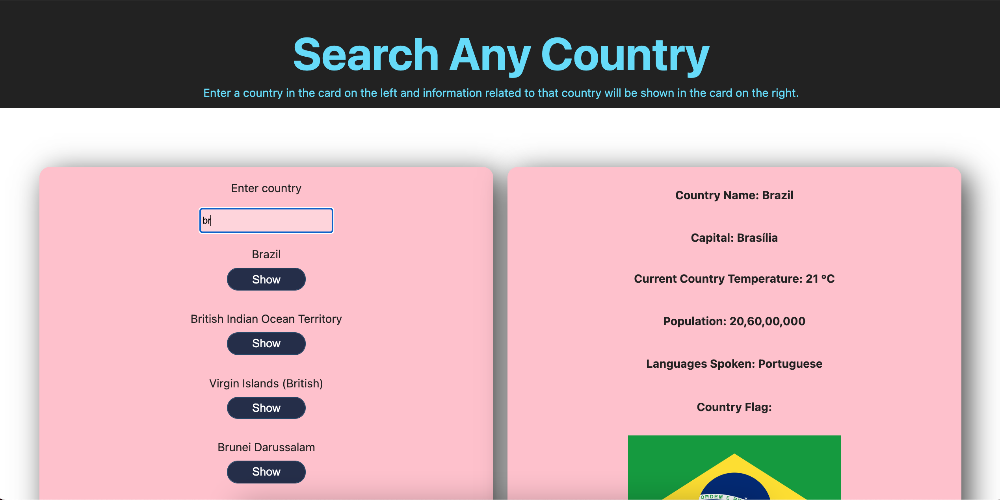

# Search Any Country: Front-End Project (Tier 2)

## Overview
This project was built so that users can search a country and find out information related to that country using two different APIs. 

## Additional Overview
This project was built to consolidate my knowledge of React.js by using props, components, react hooks (useState() & useEffect()), higher order functions, call multiple APIs, make APIs interact and explore different libraries to perform a given task ([axios](https://github.com/axios/axios)/[nanoid](https://www.npmjs.com/package/nanoid)). This project was also created to be my solo project for the Chingu tier 2 submission ([https://chingu.io/](https://chingu.io/)). Chingu is an organisation that groups a participant up with other developers around the world in order to take part in a team project using a certain tech stack of their choice at a professional level where agile sprints are carried out on a weekly basis. In the future I hope to become a fullstack javascript developer using React.js, Node.js & Typescript.

## Heroku Deployment Url
[https://search-any-country.herokuapp.com/](https://search-any-country.herokuapp.com/)

## Features
- A user can search a given country to find out the capital city of that country, the population, the language spoken, flag(Country API) and the weather temperature of that day (Weather API).
- A user has to input over one character to the search bar in order to view options.
- A user can press a button to rotate which country they want to view in the output.

## Running the project
- clone repo
- npm install
- npm start

## Dependencies
- React 
- React-Dom

## To do

- [ ] Add a UI
- [ ] Make responsive
- [ ] Make sure that you handle errors! 
- [ ] Account for an API not responding, etc.
- [ ] Make sure that your node_modules are in your .gitignore instead of on GitHub.
